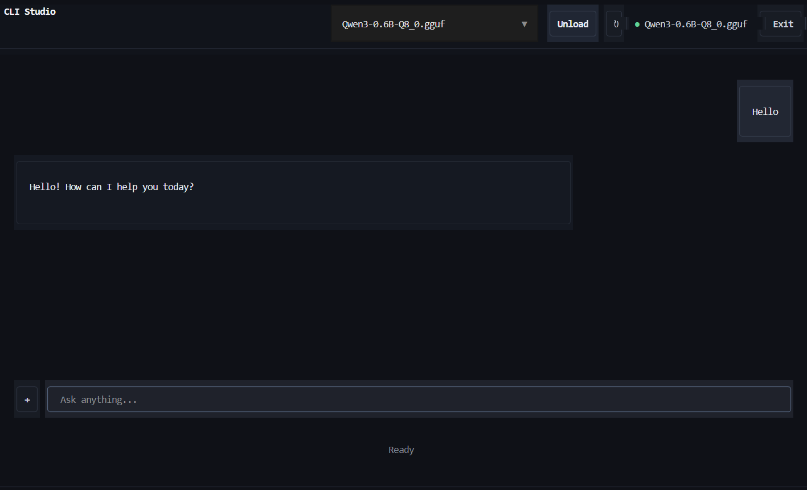
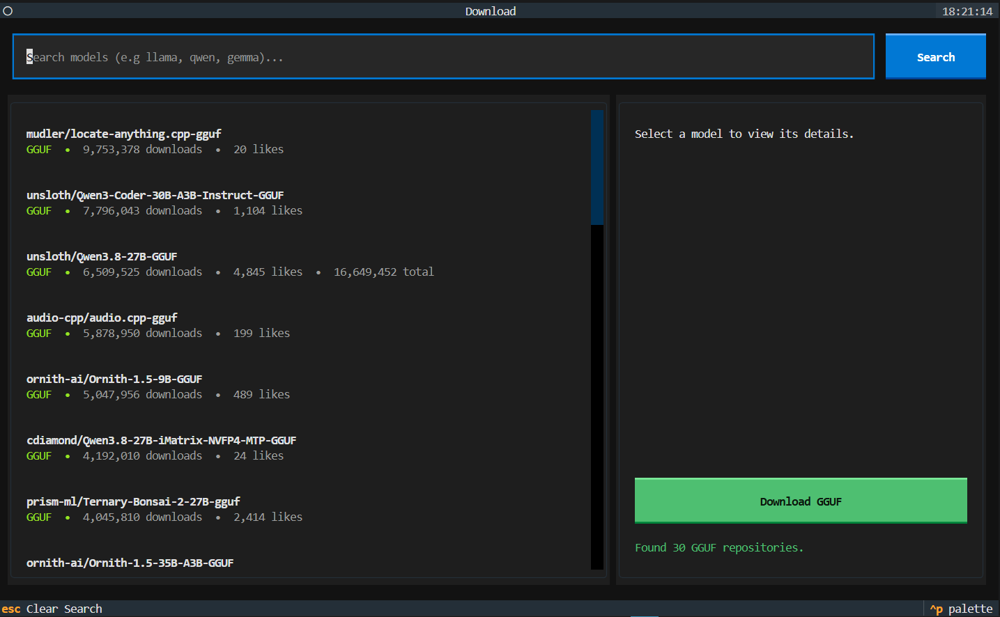
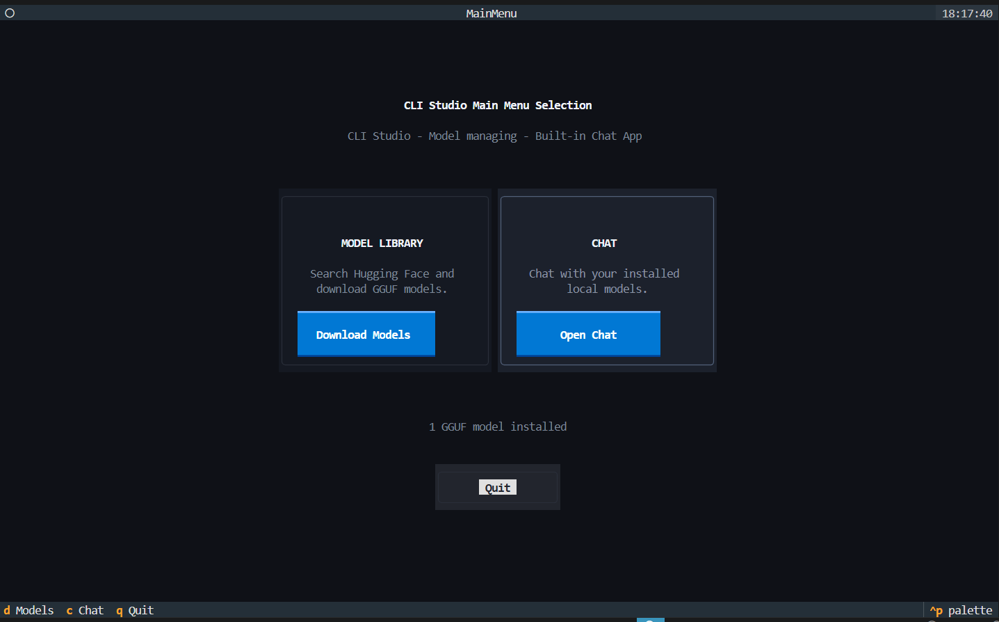

# CLI Studio





A lightweight, high-performance desktop interface and local API server powered directly by `llama.cpp`. CLI Studio provides a clean chat UI, session persistence, and custom socket API interaction without relying on heavy wrapper daemons.

## Features

- **Direct `llama.cpp` Engine:** Native C/C++ backend execution for optimal CUDA/CPU performance.
- **Setup Installation:** It *installs*, a clean build of the `llama.cpp` **inference engine**, `Cmake`, and all the other python packages if you don't have them already/.
- **Model Context Protocol (MCP) Ready:** Designed with UI hooks to integrate MCP tools and capabilities.
- **Explicit VRAM Control:** One-click model unloading to free up hardware memory instantly.

## Hardware & System Support

- **OS:** Windows 10 / 11
- **Hardware:** NVIDIA CUDA-enabled GPUs & CPU Fallback

## Prerequisites

- **Python:** 3.10 or higher

And that's about it since **my program installs the rest for you**

## Quickstart (Source Installation)

1. **Clone the repository:**
   ```bash
   git clone [https://github.com/dacoder44/cli-studio.git](https://github.com/dacoder44/cli-studio.git)
   cd cli-studio```
2. **Run the main python file**
    ```bash
    python main.py```

Then, you're all **set up.**